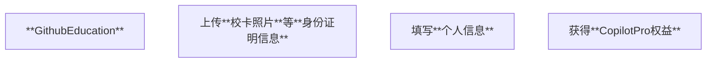

# RMYC Raspi Framework

**RMYC Raspi Framework** 是一个使用 *Raspberry Pi* 控制 *RM-S1/EP机器人*的 *Python* 框架。

## 学习指引

移步 [RMYC Raspi Framework Wiki](https://github.com/n1ghts4kura/rmyc-raspi-framework/wiki)

## Vibe-Coding 指引

### 前置依赖

---


---



---

### 如何使用AI编程?

根据我们编写的`copilot-instructions.md`和`documents/`下的多个文档，  
**理论上**只要你安装了我们**上面提到的**`Copilot`与其 *MCP* `sequentialthinking`，那么一切都会按照文档中所示运行。  
具体的**向AI提问/给AI任务**的提示词编写教程，请你自行上网搜索。  

> 这里有一个[**提示词开发必读文档**](https://www.promptingguide.ai/zh)，学会其中的很多技巧，简直就是事半功倍。  

> **好的提示词真的比你输入一堆无用信息强**。 *n1ghts4kura 2025/10/5*  

在我们的框架内使用AI辅助开发的时候，你**应该**这么 **提问/要求/回答**：

- **\*\*思考\*\***：  
    **理论上**当模型检测到正在进行一项复杂工作时，会自动调用电脑本地的 *MCP* `sequentialthinking` 工具，进行一定限度上的**链式思考**。  
    <br>
    如果你在提示词中显式键入 **\*\*思考\*\*** 那么模型一定（吧）会调用这个工具进行**链式思考**。你可以在你认为需要的情况下添加。

- **\*\*以便\*\* / \*\*为了\*\***：  
    在你描述具体做法的时候，附加上这些做法的**目的 / 意义**。  
    有的时候就是在一些小步骤中 大模型没有理解到这一步的具体意义是什么 然后就会在你的代码里面加很多没啥用的东西。  
    这一步的话 *有利于减轻* 这种情况。

- **礼貌一点**：  
    这个可能看着比较 *玄学*，但是也有研究说 **礼貌沟通** 能够提高大模型工作的**质量**。  
    反正也就在开头或者末尾加上**谢谢** **请**之类的字样吧。这个没什么能深究 の。

- **链式任务**：  
    不要**只抛一个没有任何细节的任务**给到大模型指望能完成的多好。如果你真这么干，那就**等着和大模型一点一点检查/修改代码去吧**。  
    <br>
    因此，我们在使用大模型帮助完成任务的时候，需要**一步一步指引大模型做什么事情**。  
    > 案例:  
    > 原提示词: `请你**阅读**整个项目，然后根据现有基础写自瞄技能 autoaim.py`  
    > 优化后提示词：  
    >
    > ```text
    > 好的！
    > 现在有一个新的任务：我想请你帮我创建一个**自瞄技能**。
    > 任务具体流程如下：
    > 1. 请你**阅读**整个项目，**思考**每一个模块的功能与他们之间的关系。
    > 2. **思考**完成后，将你的思考结果输出。
    > 3. 根据你所输出的思考结果，帮我在`src/skill`目录下创建一个**自瞄**技能。
    > 这个技能具体内容如下：
    > - 调用`recognizer.py`中的接口`get_latest_boxes()` **获取目标检测框在屏幕中的相对归一化位置** 
    > - 调用`src/aimassistant`中的接口，从多个检测框中**筛选出**优先级最高的框，然后计算出对准该框中心需要偏转的角度 *pitch / yaw*。
    > - 调用`src/bot`这一模块中的接口，控制机器人云台旋转。
    > - 如果在第一步中没有检测到框，算作*丢失一帧*。**丢失5帧**后，控制机器人云台顺时针旋转30°，以便寻找地方机器人。
    > ```  
    >
    > 说实话这个案例质量也不高。 *n1ghts4kura 2025/10/5*
    >

## 使用

### 1. 安装虚拟环境

```bash
$ python -m venv ./venv
$ source ./venv/bin/activate
$ pip install -r requirements.txt -i https://pypi.tuna.tsinghua.edu.cn/simple --timeout 200 --trusted-host pypi.org --trusted-host pypi.python.org --trusted-host files.pythonhosted.org
```

### 2. 运行

```bash
$ python src/main.py
```


## 致谢

- 2027届 **Aunnno** *自瞄模型相关* [*仓库地址*](https://github.com/Aunnno/RMYC-recognition)

- **2026 & 2027 届全体成员**

> **=v=**
